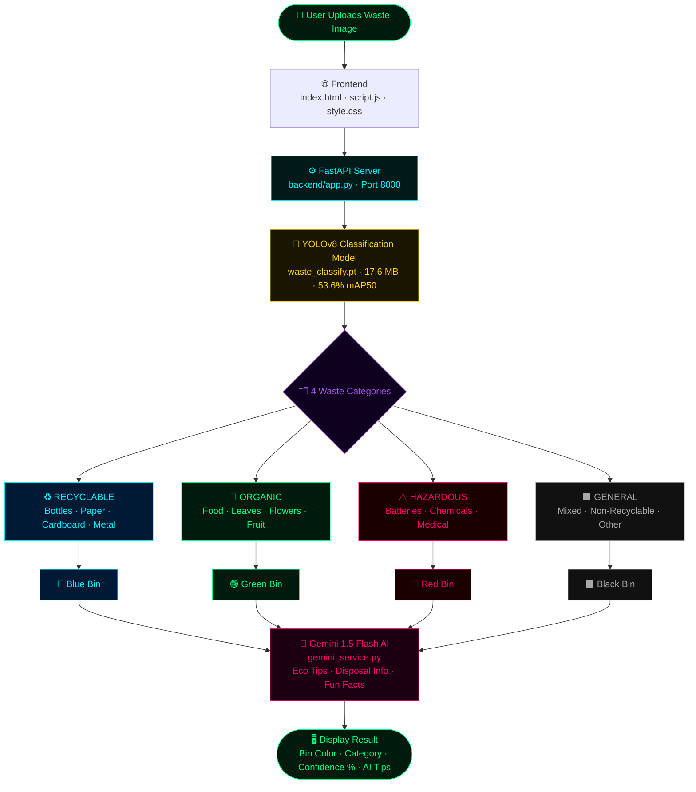
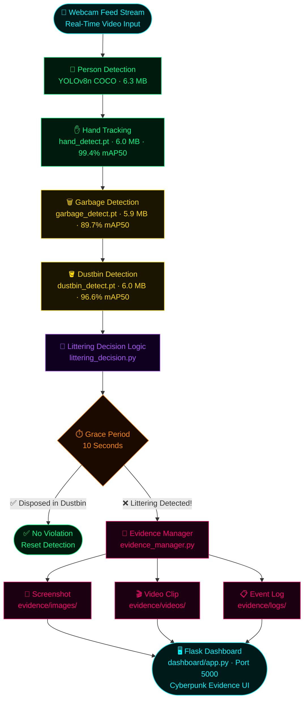
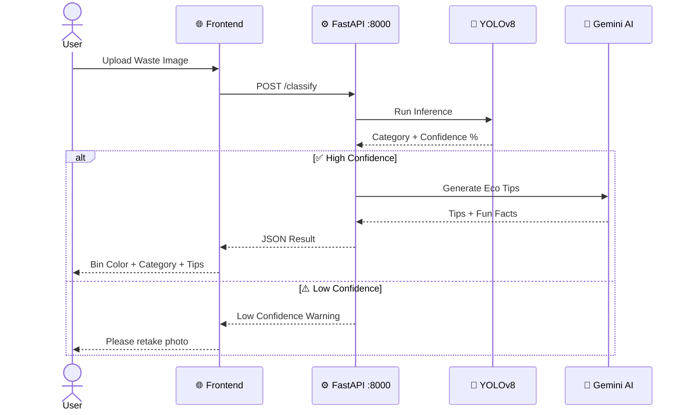
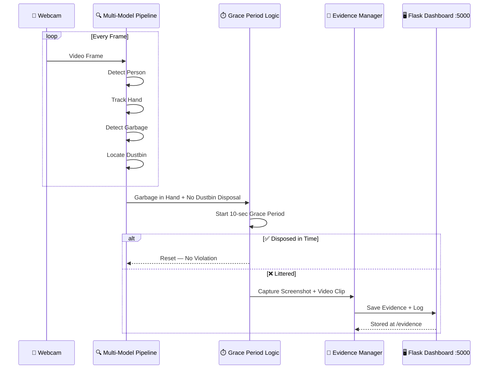
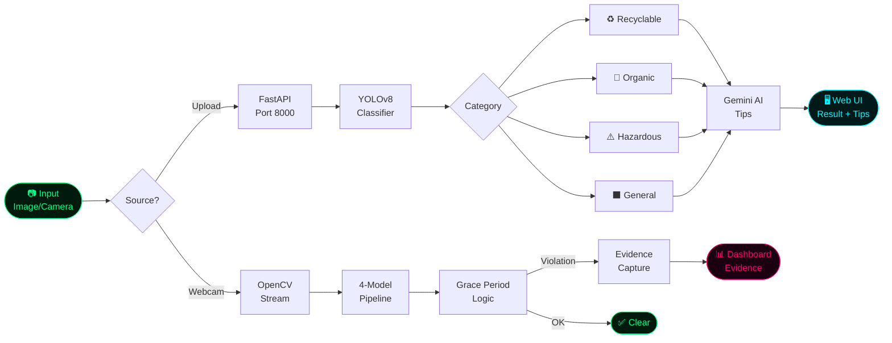
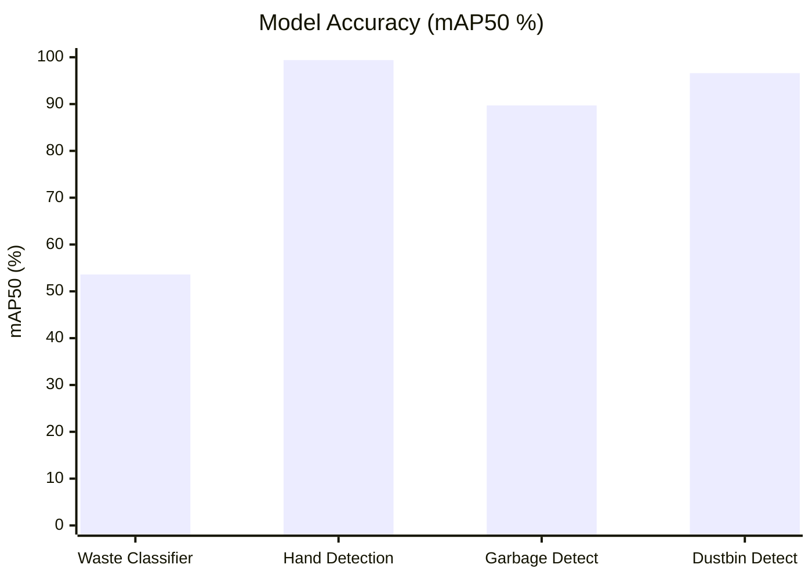
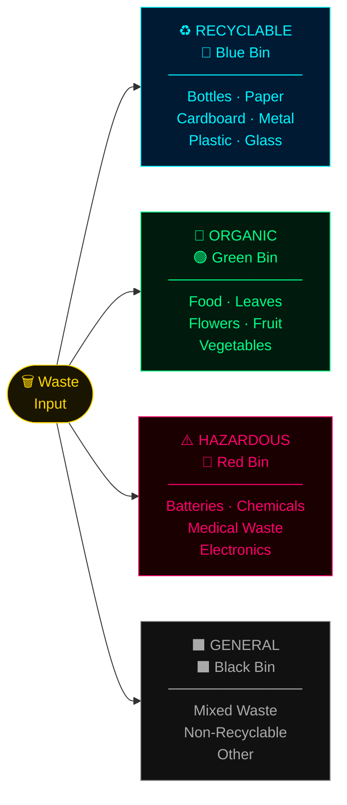
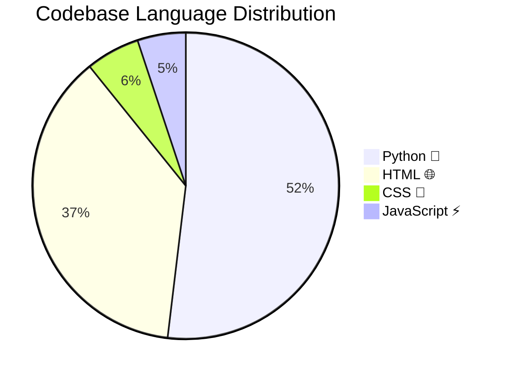
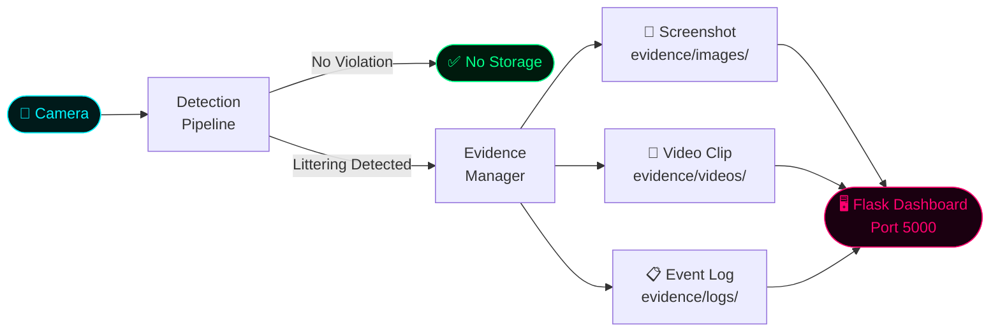
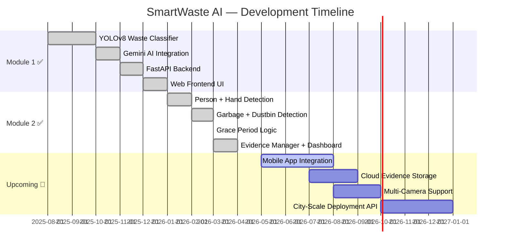

<div align="center">

<!-- TOP BANNER -->


<br/>

<!-- FUTURISTIC STAT CARDS -->
<table border="0" cellspacing="0" cellpadding="0">
<tr>
  <td align="center" width="140">
    
    
  </td>
  <td align="center" width="140">
    
  </td>
  <td align="center" width="140">
    
  </td>
  <td align="center" width="140">
    
  </td>
  <td align="center" width="140">
    
  </td>
</tr>
</table>

<br/>

<!-- TECH STACK BADGES ROW 1 -->


<!-- TECH STACK BADGES ROW 2 -->


<br/><br/>

<!-- TAGLINE -->

```
█▀ █▀▄▀█ ▄▀█ █▀█ ▀█▀ █ █ █ ▄▀█ █▀ ▀█▀ █▀▀   ▄▀█ █
▄█ █ ▀ █ █▀█ █▀▄  █  ▀▄▀▄▀ █▀█ ▄█  █  ██▄   █▀█ █
```

> 🌍 **AI-powered waste classification & real-time littering detection**
> Powered by **YOLOv8 · Computer Vision · Google Gemini AI · Python 3.13**

<br/>

<!-- NAV LINKS -->
[](#-quick-start)
[](#️-architecture)
[](#-model-performance)
[](#-project-structure)
[](#-contributing)

</div>

---

## 🎯 Two Powerful Modules

<table>
<tr>
<td width="50%" align="center">

### 🗑️ Module 1 — Waste Classifier
**FastAPI + YOLOv8 + Gemini AI**

Upload a photo → AI classifies waste type → Recommends correct dustbin color → Generates eco-tips

`Port 8000` · `4 Waste Categories` · `Gemini Tips`

</td>
<td width="50%" align="center">

### 📹 Module 2 — Littering Detector
**OpenCV + 4 YOLOv8 Models**

Real-time camera monitoring → Detects littering behavior → 10-second grace period → Auto-captures evidence

`Port 5000` · `Live Detection` · `Evidence Saved`

</td>
</tr>
</table>

---

## 🏗️ Architecture

### 🗑️ Module 1 — Waste Classifier · Port 8000



---

### 📹 Module 2 — Littering Detector · Port 5000



---

## 🔄 Request Flow



---

## 📹 Littering Detection Flow



---

## ⚡ Data Pipeline



---

## 🤖 Model Performance

| Model | Task | Accuracy | Size | Status |
|-------|------|----------|------|--------|
| 🗑️ **Waste Classifier** | 4-Class Segregation | `53.6% mAP50` | 17.6 MB | ✅ Live |
| ✋ **Hand Detection** | Object Tracking | `99.4% mAP50` | 6.0 MB | ✅ Live |
| 🗑️ **Garbage Detection** | Garbage Objects | `89.7% mAP50` | 5.9 MB | ✅ Live |
| 🪣 **Dustbin Detection** | Dustbin Location | `96.6% mAP50` | 6.0 MB | ✅ Live |
| 👤 **Person Detection** | YOLOv8n COCO | High | 6.3 MB | ✅ Live |



---

## 🎨 Waste Categories



---

## 🛠️ Tech Stack

### Core Technologies

| Layer | Technology | Version | Purpose |
|-------|-----------|---------|---------|
| 🎨 **Frontend** | HTML5 · CSS3 · JavaScript | — | Web UI for classifier |
| ⚙️ **Backend** | FastAPI | `0.109` | Waste classification API |
| 📊 **Dashboard** | Flask | `3.0` | Evidence review portal |
| 🤖 **Detection** | YOLOv8 · Ultralytics | latest | All vision models |
| 👁️ **Vision** | OpenCV | latest | Camera stream processing |
| 🧠 **Gen AI** | Google Gemini 1.5 Flash | — | Eco tips generation |
| 🔥 **ML Framework** | PyTorch | latest | Model inference |
| 💻 **Language** | Python | `3.13` | Full stack |
| 🖥️ **Hardware** | NVIDIA RTX 3050 | 4GB VRAM | GPU inference |

### Code Composition



---

## 📁 Project Structure

```
smartwaste-ai/
│
├── 🎯 main.py                        # Littering Detection Entry Point
├── 📦 requirements.txt               # All Dependencies
│
├── 📂 backend/                       # Waste Classification API · Port 8000
│   ├── app.py                        # FastAPI Server
│   ├── gemini_service.py             # Gemini AI Integration
│   └── utils.py                      # Helper Functions
│
├── 📂 frontend/                      # Web UI
│   ├── index.html                    # Main Interface
│   ├── script.js                     # Frontend Logic
│   └── style.css                     # Styling
│
├── 📂 detection/                     # Littering Detection Module
│   ├── person_detection.py           # Person Detection
│   ├── hand_detection.py             # Hand Tracking · 99.4% mAP50
│   ├── garbage_detection.py          # Garbage Detection · 89.7% mAP50
│   ├── dustbin_detection.py          # Dustbin Detection · 96.6% mAP50
│   ├── garbage_classification.py     # Waste Classification
│   ├── 📂 logic/
│   │   └── littering_decision.py     # Grace Period & Warning Logic
│   └── 📂 utils/
│       ├── evidence_manager.py       # Screenshot & Video Capture
│       └── video_utils.py            # Video Processing
│
├── 📂 dashboard/                     # Evidence Dashboard · Port 5000
│   ├── app.py                        # Flask Server
│   └── 📂 templates/                 # Cyberpunk UI
│
├── 📂 models/                        # YOLOv8 Model Weights
│   ├── waste_classify.pt             # Waste Classification · 17.6MB
│   ├── hand_detect.pt                # Hand Detection · 6.0MB
│   ├── garbage_detect.pt             # Garbage Detection · 5.9MB
│   ├── dustbin_detect.pt             # Dustbin Detection · 6.0MB
│   └── person_detect.pt              # Person Detection · 6.3MB
│
├── 📂 evidence/                      # Auto-Captured Evidence
│   ├── 📂 images/                    # Screenshots
│   ├── 📂 videos/                    # Recorded Evidence
│   └── 📂 logs/                      # Event Logs
│
└── 📂 training/                      # Model Training Scripts
    ├── train.py
    ├── train_v2.py
    └── waste_data.yaml
```

---

## 🚀 Quick Start

### Prerequisites

- **Python** `3.13+`
- **NVIDIA GPU** recommended (RTX 3050+ · 4GB VRAM)
- **Webcam** for littering detection module
- **Gemini API Key** from [Google AI Studio](https://aistudio.google.com)

### Setup & Run

```bash
# 1. Clone the repository
git clone https://github.com/YOUR_USERNAME/smartwaste-ai.git
cd smartwaste-ai

# 2. Install all dependencies
pip install -r requirements.txt

# 3. Set your Gemini API key
echo "GEMINI_API_KEY=your_api_key_here" > backend/.env
```

```bash
# ── MODULE 1: Waste Classifier ──────────────────────────
cd backend
uvicorn app:app --reload --port 8000
# Then open: frontend/index.html in your browser
```

```bash
# ── MODULE 2: Littering Detector ────────────────────────
python main.py
# Controls: q = quit | r = reset
```

```bash
# ── MODULE 3: Evidence Dashboard ────────────────────────
cd dashboard
python app.py
# Open: http://localhost:5000
```

### Port Map

| Service | Port | URL |
|---------|------|-----|
| 🗑️ Waste Classification API | `8000` | `http://localhost:8000` |
| 📊 Evidence Dashboard | `5000` | `http://localhost:5000` |
| 🌐 Frontend UI | — | Open `frontend/index.html` |

---

## 🔐 Privacy & Evidence



---

## 📈 Roadmap



---

## 🤝 Contributing

```bash
# 1. Fork the repo, then clone
git clone https://github.com/YOUR_USERNAME/smartwaste-ai.git

# 2. Create a feature branch
git checkout -b feature/amazing-feature

# 3. Commit your changes
git commit -m 'feat: add amazing feature'

# 4. Push & open a Pull Request
git push origin feature/amazing-feature
```

### Areas We Need Help With

- 🐛 Bug fixes & model accuracy improvements
- 📱 Mobile app integration
- 🌐 Additional language support for Gemini tips
- 🧪 Test coverage & CI/CD pipeline
- 📊 Analytics dashboard enhancements
- 🗺️ Multi-city deployment infrastructure

---

## 📄 License

```
Copyright (c) 2026 Piyush Dhami. All rights reserved.

This repository is provided for educational and reference purposes only.

PERMITTED:
  * You may view and download the code for personal learning.
  * You may fork this repository on GitHub.
  * You may submit issues, suggestions, and pull requests.

RESTRICTIONS:
  * You may NOT use this code in any personal, academic, or commercial project.
  * You may NOT publish, distribute, or re-upload this code (in whole or in part).
  * You may NOT use this code to build or showcase your own applications.
  * You may NOT claim this code as your own work.

ATTRIBUTION:
  If you are explicitly permitted to share any part of this code, you must
  give clear credit at the beginning:
  "Original code by Piyush Dhami (2026)"

NO LICENSE:
  Only the permissions listed above are allowed.
  Any other use is strictly prohibited.

ENFORCEMENT:
  If you violate these terms, the copyright holder may take
  appropriate legal action.
```

---

<div align="center">


**Made with 💚 for a cleaner planet**

⭐ Star this repo · 🐛 Report issues · 🤝 Contribute · 📢 Share


</div>
